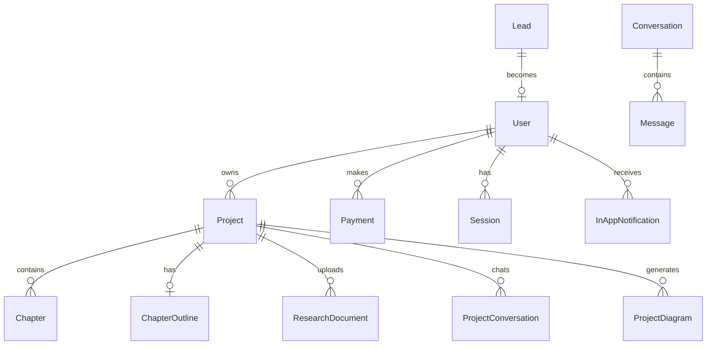

<div align="center">
  
  
  # J-Star FYB Service
  
  **🎓 AI-Powered Final Year Project Builder for Nigerian University Students**

## License
**Copyright (c) 2026 J StaR Films Studios. All Rights Reserved.**

This project is **proprietary software** belonging to J StaR Films Studios.
- You are free to **read and inspect** the code for educational purposes.
- You **may not** use it for commercial purposes, redistribute it, or modify it without permission.
- Please contact the author if you wish to negotiate a license for use.

---
  
  [](https://nextjs.org/)
  [](https://react.dev/)
  [](https://prisma.io/)
  [](https://sdk.vercel.ai/)
  [](https://www.typescriptlang.org/)
  [](https://tailwindcss.com/)
  
  [Live Demo](#) • [Features](#-features) • [Quick Start](#-quick-start) • [Architecture](#-architecture) • [API Reference](#-api-reference)

</div>

---

## 📖 Overview

J-Star FYB Service is a comprehensive SaaS platform designed to help final year university students in Nigeria complete their academic projects. It combines an **AI-powered DIY builder** for budget-conscious students with a **full-service agency model** for those who want professional assistance.

### 🎯 The Two Paths

| Path | Target User | Price Range | What They Get |
|------|-------------|-------------|---------------|
| **DIY Builder** | Budget-conscious students | ₦15,000 - ₦20,000 | AI-generated abstracts, outlines, chapters, research grounding |
| **Agency Service** | Premium clients | ₦60,000 - ₦320,000 | Full human-written documentation, code, defense prep |

---

## ✨ Features

### 🤖 AI-Powered Writing Assistants

| Bot | Personality | Purpose |
|-----|-------------|---------|
| **Jay** | "Senior Dev" Nigerian tech slang | Sales consultant - refines topics, suggests "J-Star Twists" |
| **Nengi** | Chill, observant friend | Hub intelligence - brainstorming, emotional support |
| **Monji** | Academic writing expert | Project assistant - context-aware editing, chapter generation |

### 📝 Core Capabilities

- **🎨 Premium Landing Page** - High-impact marketing with 3D effects, scroll animations, glassmorphism
- **💬 AI Sales Consultant** - Conversational topic refinement with lead capture
- **📊 Project Wizard** - Step-by-step abstract → outline → chapters generation
- **✍️ Writing Workspace** - Full chapter editing with AI enhancement, versioning, auto-save
- **📚 Research Integration** - Upload PDFs, automatic citation with Gemini File Search
- **📄 Document Export** - DOCX/PDF export with embedded images and Mermaid diagrams
- **💳 Payments** - Paystack integration with webhooks, proration, and upsells
- **👤 Authentication** - Better-Auth with Google OAuth and role-based access
- **🔔 Notifications** - In-app and email notifications via Resend
- **📱 Mobile-First** - Responsive design with bottom navigation and immersive modes

### 🧠 AI Integration

| Provider | Model | Use Case |
|----------|-------|----------|
| Groq | `openai/gpt-oss-120b` | Jay chat and topic extraction |
| OpenRouter | `nvidia/nemotron-3-ultra-550b-a55b:free` | High-quality standard chapter generation |
| OpenRouter | `openai/gpt-oss-120b:free` | Research paper summarization / fallback |
| Google | `gemini-2.5-flash` | Grounded generation with File Search |
| Groq | `llama-3.3-70b-versatile` | Fast outline generation |
| OpenRouter | `tngtech/tng-r1t-chimera:free` | Reasoning traces for complex tasks |

---

## 🚀 Quick Start

### Prerequisites

- **Node.js** 20+ 
- **pnpm** (recommended) or npm
- **PostgreSQL** (production) or SQLite (development)

### Installation

```bash
# Clone the repository
git clone https://github.com/JStaRFilms/2025-12-15_jstar-fyb-service.git
cd 2025-12-15_jstar-fyb-service

# Install dependencies
pnpm install

# Copy environment variables
cp .env.example .env

# Configure your .env file (see Configuration section below)

# Generate Prisma client and run migrations
pnpm prisma generate
pnpm prisma migrate dev

# Start development server
pnpm dev
```

Open [http://localhost:3000](http://localhost:3000) to see the application.

### Configuration

Create a `.env` file with the following variables:

```env
# ==============================================
# DATABASE
# ==============================================
DATABASE_URL="file:./dev.db"           # SQLite for dev
DATABASE_PROVIDER="sqlite"             # or "postgresql" for production

# ==============================================
# BETTER AUTH
# ==============================================
BETTER_AUTH_SECRET="your-secret-key"   # Generate: openssl rand -base64 32
BETTER_AUTH_URL="http://localhost:3000"
GOOGLE_CLIENT_ID="your-google-client-id"
GOOGLE_CLIENT_SECRET="your-google-client-secret"

# ==============================================
# AI PROVIDERS
# ==============================================
GOOGLE_API_KEY="your-google-api-key"
GROQ_API_KEY="your-groq-api-key"
GEMINI_API_KEY="your-gemini-api-key"
OPENROUTER_API_KEY="your-openrouter-api-key"

# ==============================================
# PAYMENTS (Paystack)
# ==============================================
PAYSTACK_SECRET_KEY="sk_test_..."
PAYSTACK_PUBLIC_KEY="pk_test_..."

# ==============================================
# EMAIL (Resend)
# ==============================================
RESEND_API_KEY="re_..."
RESEND_FROM_EMAIL="J-Star Projects <noreply@yourdomain.com>"

# ==============================================
# ADMIN
# ==============================================
ADMIN_USERNAME="admin"
ADMIN_PASSWORD="your-secure-password"

# ==============================================
# APP
# ==============================================
NEXT_PUBLIC_APP_URL="http://localhost:3000"
```

---

## 🏗️ Architecture

### Tech Stack

| Layer | Technology |
|-------|------------|
| **Framework** | Next.js 16 (App Router) |
| **Language** | TypeScript 5 |
| **Styling** | Tailwind CSS 3.4 + Framer Motion |
| **Database** | PostgreSQL (Neon) / SQLite |
| **ORM** | Prisma 5.22 |
| **Auth** | Better-Auth with Prisma adapter |
| **AI** | Vercel AI SDK 6.0, Google GenAI |
| **Payments** | Paystack |
| **Email** | Resend + React Email |
| **Editor** | TipTap with Markdown support |
| **State** | Zustand |
| **Validation** | Zod |

### Project Structure

```
src/
├── app/                    # Next.js App Router
│   ├── (marketing)/        # Public landing pages
│   ├── (saas)/             # Protected SaaS routes
│   │   ├── chat/           # Jay (Sales Bot)
│   │   ├── hub/            # Nengi (Hub Intelligence)
│   │   ├── dashboard/      # User dashboard
│   │   └── project/        # Builder & Workspace
│   ├── admin/              # Admin panel
│   └── api/                # API routes
│       ├── chat/           # Jay chat endpoint
│       ├── generate/       # AI generation endpoints
│       ├── projects/       # Project CRUD + Monji chat
│       ├── pay/            # Payment + webhooks
│       └── documents/      # File upload & processing
├── features/               # Feature-sliced modules
│   ├── auth/               # Authentication
│   ├── bot/                # AI chat (Jay, Nengi)
│   ├── builder/            # Project wizard & workspace
│   ├── marketing/          # Landing page components
│   ├── admin/              # Admin dashboard
│   └── support/            # Support tickets
├── components/             # Shared UI components
├── services/               # Business logic layer
├── lib/                    # Core utilities
└── config/                 # Configuration files
```

### Database Schema



### Data Flow

```
┌──────────────────────────────────────────────────────────────┐
│                     STUDENT LANDS                             │
└──────────────────────────────┬───────────────────────────────┘
                               │
                               ▼
┌──────────────────────────────────────────────────────────────┐
│                 CHAT WITH AI CONSULTANT (JAY)                 │
│           (Free - Qualifies Lead, Refines Topic)              │
└──────────────────────────────┬───────────────────────────────┘
                               │
              ┌────────────────┴────────────────┐
              │                                 │
              ▼                                 ▼
┌─────────────────────────┐       ┌─────────────────────────┐
│      LOW BUDGET          │       │      HIGH BUDGET         │
│   "I want to DIY it"     │       │   "Do it for me"         │
└───────────┬─────────────┘       └───────────┬─────────────┘
            │                                 │
            ▼                                 ▼
┌─────────────────────────┐       ┌─────────────────────────┐
│     AI BUILDER (SaaS)    │       │    AGENCY SERVICE        │
│      ₦15k - ₦20k         │       │    ₦60k - ₦320k          │
└───────────┬─────────────┘       └─────────────────────────┘
            │
            │ (Gets stuck writing code?)
            │
            ▼
┌──────────────────────────────────────────────────────────────┐
│                      UPSELL TO AGENCY                         │
│   "Stuck? Hire us for ₦120k (minus the ₦15k you paid)"       │
└──────────────────────────────────────────────────────────────┘
```

---

## 📄 API Reference

### AI Generation Endpoints

| Endpoint | Method | Description |
|----------|--------|-------------|
| `/api/generate/abstract` | POST | Generate project abstract |
| `/api/generate/outline` | POST | Generate 5-chapter outline |
| `/api/generate/chapter` | POST | Generate individual chapter |

### Project Management

| Endpoint | Method | Description |
|----------|--------|-------------|
| `/api/projects/[id]` | GET | Get project details |
| `/api/projects/[id]/chapters` | GET | Get all chapters |
| `/api/projects/[id]/chapters/[num]` | PATCH | Update chapter content |
| `/api/projects/[id]/chat` | POST | Chat with Monji (Project AI) |

### Chat Endpoints

| Endpoint | Method | Description |
|----------|--------|-------------|
| `/api/chat` | POST | Chat with Jay (Sales Bot) |
| `/api/hub/chat` | POST | Chat with Nengi (Hub Intelligence) |

### Payment Endpoints

| Endpoint | Method | Description |
|----------|--------|-------------|
| `/api/pay/initialize` | POST | Initialize Paystack payment |
| `/api/pay/webhook` | POST | Paystack webhook handler |
| `/api/pay/verify` | GET | Verify payment status |

---

## 📦 Key Dependencies

| Package | Version | Purpose |
|---------|---------|---------|
| `ai` | ^6.0.16 | Vercel AI SDK for streaming |
| `@ai-sdk/react` | ^3.0.16 | React hooks for AI |
| `@ai-sdk/google` | ^3.0.5 | Google AI provider |
| `@openrouter/ai-sdk-provider` | ^1.5.4 | OpenRouter integration |
| `better-auth` | ^1.4.9 | Authentication framework |
| `@prisma/client` | 5.22.0 | Database ORM |
| `@tiptap/react` | ^2.11.2 | Rich text editor |
| `framer-motion` | ^12.23.26 | Animations |
| `docx` | ^9.5.1 | DOCX export |
| `mermaid` | ^11.12.2 | Diagram generation |
| `zustand` | ^5.0.9 | State management |

---

## 🛠️ Scripts

```bash
# Development
pnpm dev              # Start dev server
pnpm build            # Production build
pnpm start            # Start production server
pnpm lint             # Run ESLint

# Database
pnpm prisma generate  # Generate Prisma client
pnpm prisma migrate dev  # Run migrations
pnpm prisma studio    # Open Prisma Studio

# Admin Scripts
npx tsx scripts/promote-admin.ts <email>  # Promote user to admin
npx tsx scripts/list-users.ts             # List all users
npx tsx scripts/test-webhook.ts           # Test Paystack webhook
```

---

## 🚢 Deployment

### Vercel (Recommended)

1. Push to GitHub
2. Connect repository to Vercel
3. Configure environment variables
4. Deploy

The `vercel.json` is pre-configured:

```json
{
  "framework": "nextjs",
  "buildCommand": "npx prisma generate && next build",
  "installCommand": "pnpm install"
}
```

### Database Setup (Neon)

1. Create a Neon project at [neon.tech](https://neon.tech)
2. Get connection string
3. Update `DATABASE_URL` and set `DATABASE_PROVIDER="postgresql"`
4. Run `pnpm prisma migrate deploy`

---

## 🔐 Security Notes

> ⚠️ **Important**: Review the [SECURITY_AUDIT_REPORT.md](SECURITY_AUDIT_REPORT.md) before production deployment.

Key security features implemented:
- **HMAC-SHA512** webhook signature verification
- **Role-based access control** (USER, ADMIN)
- **Input validation** with Zod schemas
- **Prisma ORM** for SQL injection prevention
- **Secure session management** via Better-Auth

---

## 📚 Documentation

Detailed documentation is available in the `docs/` directory:

| Document | Description |
|----------|-------------|
| [Project_Requirements.md](docs/Project_Requirements.md) | Full functional & technical requirements |
| [Business_Model.md](docs/Business_Model.md) | Pricing tiers and upsell strategy |
| [project_architecture.md](docs/project_architecture.md) | Application flow and philosophy |
| [features/](docs/features/) | Individual feature specifications |
| [DIY_Writing_Workflow.md](docs/features/DIY_Writing_Workflow.md) | Complete writing workflow implementation |

---

## 🤝 Contributing

1. Fork the repository
2. Create your feature branch (`git checkout -b feature/amazing-feature`)
3. Commit your changes (`git commit -m 'Add amazing feature'`)
4. Push to the branch (`git push origin feature/amazing-feature`)
5. Open a Pull Request

---

## 📄 License

This project is proprietary software owned by J-Star Films.

---

## 👨‍💻 Author

**John Oluleke-Oke** - [@JStaRFilms](https://github.com/JStaRFilms)

---

<div align="center">
  <sub>Built with ❤️ in Ado, Nigeria</sub>
</div>
