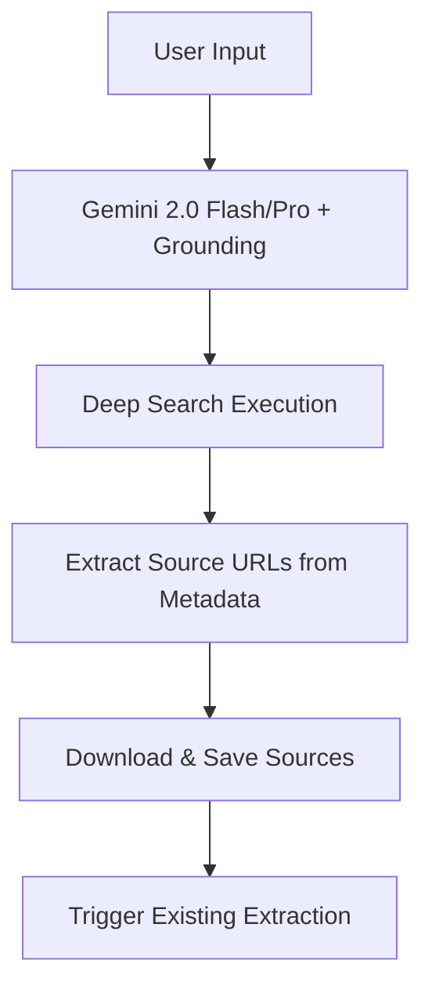

# Deep Research & Source Retrieval Implementation Plan

## Overview

This feature provides users with two distinct methods for conducting deep research.
**PRIMARY GOAL:** Find, Download, and Save PDF/Document sources to the `ResearchDocument` table.
**Note**: Once valid files/URLs are saved to the database, the existing background extraction system will handle content analysis. We do not need to re-implement summarization here.

### Research Modes
1.  **Standard Research (Custom Pipeline)**: Cost-effective. Uses `tngtech/tng-r1t-chimera:free` for reasoning, OpenRouter (Exa) for search, and direct PDF downloading.
2.  **Deep Research (Gemini Native)**: Premium. Uses Gemini 2.0 with Google Search Grounding to find authoritative sources, which we then attempt to download/save.

## Architecture & Workflows

### 1. Standard Research (Custom Pipeline)

Focus: "Think, Search, Download".

```mermaid
graph TD
    A[User Input: Topic + Context] --> B{Topic Analysis}
    B -->|Reasoning Model| C[Generate Search Queries]
    C --> D[Web Search (OpenRouter/Exa)]
    D --> E[Filter & Select Sources]
    E --> F{Fetch Content}
    F -->|PDF URL| G[Download & Save File]
    F -->|Webpage| H[Save URL as Source]
    G & H --> I[Trigger Existing Extraction]
```

#### Detailed Steps

1.  **Query Generation**:
    *   **Input**: Project Topic, Twist/Context.
    *   **System Prompt**: `docs/writing workflow/Notebook LM Research Sources.md`.
    *   **Model**: `tngtech/tng-r1t-chimera:free` (User's choice for reasoning).
    *   **Output**: JSON list of categorized search queries.

2.  **Search & Discovery**:
    *   **Action**: Execute search queries.
    *   **Tool**: OpenRouter API with `plugins: [{ id: "web", engine: "exa" }]`.
    *   **Goal**: Retrieve high-quality URLs (`.pdf`, academic domains).
    *   **Filtering**: Select top candidates based on title/snippet.

3.  **Acquisition (The "Get PDFs" Step)**:
    *   **Action**: Attempt to download the content.
    *   **If PDF**: Download binary -> Save to `ResearchDocument` (`fileData` or valid public `fileUrl`).
    *   **If Webpage**: Save `fileUrl` -> `ResearchDocument` (`mimeType: text/html`).
    *   **Status**: Set to `PENDING` to trigger existing extraction logic.

### 2. Deep Research (Gemini Native)

Focus: "Super Searcher" using Gemini's native grounding capabilities.



*   **Tool**: Google Gen AI SDK (`@google/generative-ai`).
*   **Model**: Configurable (Default: `gemini-2.0-flash-exp` / User requested: `gemini-2.5-flash` or latest).
*   **Configuration**: `tools: [{ googleSearch: {} }]`.
*   **Process**:
    1.  Call Gemini with the research prompt + `googleSearch` tool.
    2.  **Extraction**: Access `response.candidates[0].groundingMetadata.groundingChunks`.
    3.  **Map**: Extract `web.uri` and `web.title` from each chunk.
    4.  **Pipeline**: Pass these high-quality URLs to the **Acquisition Pipeline** (Same as Standard Mode).

## Data Model

We utilize the existing `ResearchDocument` model. No schema changes required.

```prisma
model ResearchDocument {
  id                   String    @id @default(cuid())
  projectId            String
  fileUrl              String?   // Origin URL
  fileData             Bytes?    // Downloaded content (if PDF)
  mimeType             String?   // "application/pdf"
  status               String    @default("PENDING") // This triggers the background worker
  // ... other fields populated by existing system
}
```

## API Routes & Services

### 1. `POST /api/research/plan`
*   **Purpose**: Step 1 - Generate search queries.
*   **Body**: `{ projectId }`
*   **Model**: `tngtech/tng-r1t-chimera:free`.

### 2. `POST /api/research/execute` (Long-running/Streaming)
*   **Purpose**: Steps 2-3 - Search, Download, Save.
*   **Body**: `{ projectId, queries, mode: "standard" | "deep" }`
*   **Functionality**:
    *   **Standard**: Run Exa search -> Download results.
    *   **Deep**: Run Gemini Grounding -> Extract URLs -> Download results.
    *   **Output**: Stream status updates ("Searching...", "Found 5 PDFs...", "Downloading...", "Saved.").

### 3. `GET /api/projects/:id/research`
*   **Purpose**: List all research documents for a project.

## UI/UX Plan

### Mode Selection
*   **Standard (Custom)**: Uses user-defined reasoning model + Exa.
*   **Deep (Gemini)**: Uses Gemini 2.0 Grounding.

### Progress UI
*   Visual "Terminal" showing the pipeline steps:
    *   `> Generating Queries (Reasoning)...`
    *   `> Searching Web...`
    *   `> Found [PDF] "Deep Learning Survey.pdf"`
    *   `> Downloading... [Success]`
    *   `> Saved to Project Documents.`

## Implementation Roadmap

- [ ] **Phase 1: Foundation (Standard Mode)**
    - [ ] Update `AiService` to support `tngtech/tng-r1t-chimera:free`.
    - [ ] Implement `ResearchService.generateQueries`.
    - [ ] Implement `ResearchService.searchAndDownload` (Exa + Fetch).

- [ ] **Phase 2: Deep Mode (Gemini)**
    - [ ] Implement `GeminiService.groundedSearch`:
        - [ ] Configure `googleSearch` tool.
        - [ ] Parse `groundingMetadata.groundingChunks` for `web.uri`.
    - [ ] Connect Gemini URLs to `ResearchService.download` logic.

- [ ] **Phase 3: Integration**
    - [ ] Create API Endpoints.
    - [ ] Frontend UI (Modal + Progress).
