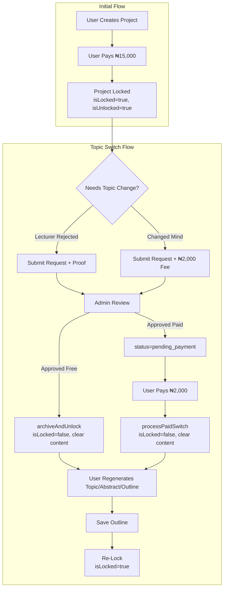

# FR-014: Topic Lock & Project Switch Rules

## Goal
Implement business rules to prevent account sharing while allowing legitimate topic changes.
This system ensures that:
1.  Users commit to a topic before paying.
2.  Users cannot abuse the system by creating unlimited projects for different people under one account.
3.  Legitimate users (e.g., topic rejected by lecturer) have a path to switch topics either for free (with proof) or for a fee (if changing mind).

## Architecture

## Key Components

### Database Schema
- **`Project.isLocked`**: Boolean, true = topic cannot be changed.
- **`Project.isUnlocked`**: Boolean, true = workspace is paid and accessible.
- **`Project.topicSwitchCount`**: Int, tracks number of topic switches (enforces one-time limit).
- **`TopicSwitchRequest`**: Tracks switch requests with status: `pending` → `pending_payment` → `approved` / `denied`.
- **`TopicSwitchArchive`**: Archives old project content before clearing.

### Backend Services
| Service | File | Purpose |
|---------|------|---------|
| `ProjectsService` | `src/services/projects.service.ts` | `createProject`, `lockProject`, `unlockProject`. **Critical**: Reuses paid unlocked projects instead of creating new ones. |
| `TopicSwitchService` | `src/services/topic-switch.service.ts` | `createRequest`, `reviewRequest`, `processPaidSwitch`, `archiveAndUnlock`. |

### API Routes
| Route | Method | Purpose |
|-------|--------|---------|
| `/api/support/topic-switch` | POST | Submit a switch request |
| `/api/admin/requests/[id]/review` | POST | Admin approves/denies request |
| `/api/pay/switch/initialize` | POST | Initialize ₦2,000 payment for approved requests |
| `/api/pay/verify` | POST | Verifies payments, handles `type: topic_switch` in metadata |
| `/api/projects/[id]/outline` | POST | Saves outline, **re-locks** paid projects after switch |

### UI Components
| Component | Purpose |
|-----------|---------|
| `TopicSwitchRequestForm` | Form with reason selection, proof upload. Shows status: Pending/Approved/Denied. |
| `TopicSwitchPaymentVerifier` | Client component on `/profile` that detects `?reference=switch_...` and triggers verification. |
| `TopicLockModal` | Warning modal before payment, requires checkbox confirmation. |
| `WorkspaceLockScreen` | Lock screen with "Unlock Now" button that triggers `TopicLockModal`. |

## Data Flow: Topic Switch Payment

1.  **Submit Request**: User submits request via `TopicSwitchRequestForm` → `/api/support/topic-switch` (fee passed).
2.  **Admin Approval**: Admin approves → `TopicSwitchService.reviewRequest` sets status to `pending_payment`.
3.  **Payment UI**: Profile page shows "Pay ₦2,000" button via `TopicSwitchRequestForm` (detects `pending_payment` status).
4.  **Payment Init**: User clicks pay → `/api/pay/switch/initialize` → Paystack with `metadata: { type: "topic_switch", requestId }`.
5.  **Redirect**: User returns to `/profile?payment=verifying&reference=switch_...`.
6.  **Verification**: `TopicSwitchPaymentVerifier` detects reference → calls `/api/pay/verify`.
7.  **Processing**: Verify route detects `type: topic_switch` → calls `processPaidSwitch` → archives content, clears project, sets `isLocked: false`.
8.  **Regeneration**: User goes to builder, regenerates topic/abstract/outline.
9.  **Re-Lock**: On outline save, `/api/projects/[id]/outline` detects paid unlocked project → sets `isLocked: true`.

## Hotfixes / Changelog

### Hotfix 2026-01-05: Fee Passing Bug
- **Problem:** `/api/support/topic-switch` was not passing the `fee` field to `TopicSwitchService.createRequest()`, causing fee-based requests to be treated as free.
- **Solution:** Added `fee` to destructuring and service call.

### Hotfix 2026-01-05: Step Routing for Unlocked Projects
- **Problem:** `useBuilderStore.loadProject` routed users to ABSTRACT step even when project was unlocked for topic switch (had topic but no abstract).
- **Solution:** Added `isUnlockedForTopicSwitch` check to force TOPIC step.

### Hotfix 2026-01-05: Project ID Preservation
- **Problem:** `projects.service.ts` created new projects after topic switch instead of reusing the paid one, orphaning payment history.
- **Solution:** Added check for unlocked PAID projects (`isUnlocked: true`) and updates them instead of creating new.

### Hotfix 2026-01-05: Re-Lock After Switch
- **Problem:** After topic switch, the project remained unlocked indefinitely.
- **Solution:** `/api/projects/[id]/outline` POST now re-locks paid projects (`isUnlocked && !isLocked`) after outline save.

### Hotfix 2026-01-05: Non-Atomic Lock State Updates (CRITICAL)
- **Problem:** `billing.service.ts:updateProjectUnlock()` made two separate DB calls - first setting `isUnlocked: true`, then calling `lockProject()` separately. If the second call failed or user navigated away between calls, the project ended up in an inconsistent state (`isUnlocked: true, isLocked: false`).
- **Solution:** Made update atomic by including `isUnlocked: true`, `isLocked: true`, and `lockedAt` in a single DB call. Removed the separate `lockProject()` call.

### Hotfix 2026-01-05: Unlock Route Missing Lock Flag
- **Problem:** `/api/projects/[id]/unlock/route.ts` only set `isUnlocked: true` without setting `isLocked: true`, creating potential inconsistent state.
- **Solution:** Added `isLocked: true` and `lockedAt` to the same atomic update.

### Hotfix 2026-01-05: Redundant DB Query in Builder Page
- **Problem:** `builder/page.tsx` made a second DB query for `isUnlocked` when it was already available on the `recentProject` object from the first query.
- **Solution:** Captured `isUnlocked` directly from `recentProject` during mapping, eliminating the redundant query and potential race condition.

### Hotfix 2026-04-08: Topic Lock Modal State Reset
- **Problem:** `TopicLockModal` preserved stale amount, acknowledgement, and discount state across reopenings because the local state was only initialized on first mount.
- **Solution:** Added an `amount`/`isOpen` sync effect so opening the modal resets the displayed amount and clears previous acknowledgement and discount state.
