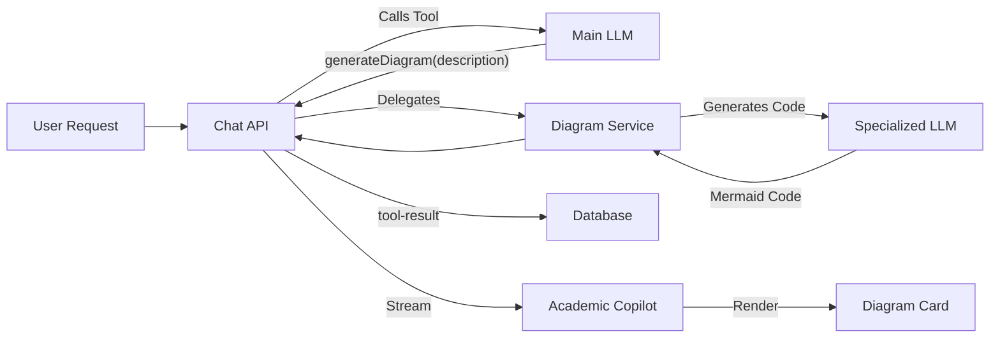

# AI Diagram Generation

## Overview
The AI Diagram Generation feature allows users to generate visual representations of their project content (flowcharts, architecture diagrams, sequence diagrams) directly within the Academic Copilot chat. It uses Mermaid.js for rendering and a specialized AI delegation pattern to ensure high-quality syntax generation.

## Architecture
- **Service:** `src/lib/ai/diagramService.ts`
- **API Router:** `src/app/api/projects/[id]/chat/route.ts` & `src/app/api/generate/diagram/route.ts`
- **UI Component:** `src/features/builder/components/v2/DiagramSuggestionCard.tsx`
- **Dependencies:** `mermaid`, `lucide-react`

## Key Components

### Diagram Service (`diagramService.ts`)
A shared service that handles the actual generation of Mermaid code. It uses a specialized system prompt that enforces strict Mermaid syntax rules (quoting, node IDs) to minimize rendering errors.
- **Function:** `generateDiagramCode(params)`
- **Delegation:** The main chat model calls `generateDiagram` with a description, which is then passed to this service to generate the actual code.

### Diagram Suggestion Card (`DiagramSuggestionCard.tsx`)
A React component that displays the generated diagram in a dismissible card within the chat interface.
- **Features:**
  - Live Mermaid rendering
  - "Insert" button: Saves to DB and inserts into document
  - "Save to Project" button: Saves to DB only
  - "Reject" button: Dismisses the card

### Tool Persistence
Diagram suggestions persist across page reloads.
- **Backend:** `onFinish` callback in `chat/route.ts` captures `toolCalls` and `toolResults` from SDK `steps` and saves them to the `toolInvocations` JSON field in `ProjectChatMessage`.
- **Frontend:** `AcademicCopilot.tsx` reconstructs the suggestion state and "Generating..." status indicator from loaded messages on mount.

## Data Flow

## Persistence Pattern
The system uses a robust persistence pattern for tool calls:
1. **Save:** `route.ts` extracts `step.content[].type === 'tool-call'` and saves to Prisma.
2. **Load:** `AcademicCopilot.tsx` reads `toolInvocations` from DB messages.
3. **Map:** `completed` DB state maps to `result` UI state to trigger success indicators.

## Configuration
| Setting | Type | Default | Description |
|---------|------|---------|-------------|
| `provider` | string | `openrouter` | AI provider for diagram generation |
| `model` | string | `mimo-v2-flash` | Lightweight model optimized for code generation |
