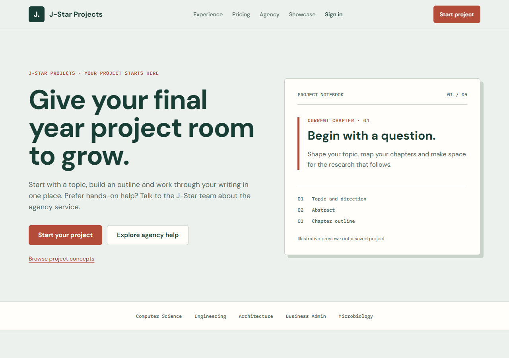
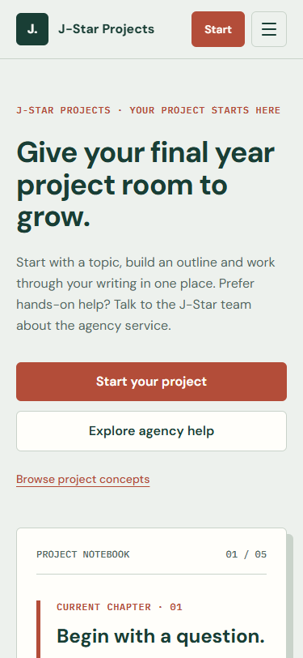
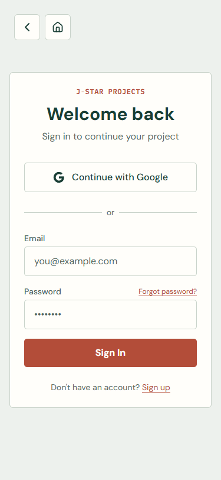

# J-Star Projects: the Margin walkthrough

## Open it

Run `pnpm dev`, then visit `/`. The first screen introduces the new name and the project notebook. Open `/auth/login` or `/auth/register` for the paper-form treatment. After signing in, visit `/dashboard` and `/profile`, continue into `/project/builder`, and open a paid or otherwise unlocked project at `/project/[id]/workspace` to see the chapter margin, writing canvas and research shelf.

This is a UI rebrand, not a new signup, payment or writing flow. The original concept comparison is at [`../mockups/rebrand-directions.html`](../mockups/rebrand-directions.html); the approved production spec is [`../features/Margin_Rebrand.md`](../features/Margin_Rebrand.md).

## What to notice

- The customer-facing name is **J-Star Projects**. J-Star Films remains the owner. Existing domains, URLs, project data, API names and internal `jstar:*` identifiers did not change.
- Paper `#EDF1ED` and writing surface `#FFFEFA` replace the dark neon background on the active marketing and student journey. Ink `#193E35` carries content; rust `#B34D39` marks an action or the current chapter. DM Sans handles the interface, and IBM Plex Mono is reserved for chapter labels and short metadata.
- The landing hero shows a clearly labelled illustrative notebook, not an invented saved project. Pricing still comes from the existing configuration. Gallery items are labelled as concepts rather than verified student case studies.
- On the dashboard, profile and builder, the real project topic, account, step and payment state still drive the UI. In the active v2 workspace, the chapter list, writing canvas, research panel and chat stay connected to the existing save and export code. The rust rule belongs to the current document, not exported text.
- Secondary editor tools, including history, image insertion, enhancement, diagrams and the deep-research modal, use the same light surfaces. Chat tool results also use readable text on light cards. The PWA icon, Open Graph image and product metadata use the new mark and name.

## Screenshots

Desktop landing:

Narrow-screen landing:

Mobile login:

## Quick check for the next pass

1. At `/`, switch the paper/software pricing tabs. Both should continue to show the existing configured amounts and route to the same builder or consultation paths.
2. Open a project concept in the gallery. The dialog says it is illustrative; Escape closes it, and the previous/next controls cycle through concepts. At phone width, the dialog scrolls rather than cutting off its close control.
3. At 320px wide, the navigation still shows the brand, a compact Start button and the menu without horizontal clipping. At 375px, open the menu and follow Sign in.
4. In an authenticated project, check both empty and populated dashboard states. In the builder, move from topic through abstract to outline. Confirm the payment gate still blocks locked content.
5. In an unlocked project, switch chapters, format text with bold and italic, save a draft, open version history, add a research document, visit the chat and diagrams tabs, and repeat on a phone. Confirm text remains readable against paper and the save indicator reflects the actual status.

## Verification and boundaries

`pnpm exec tsc --noEmit --incremental false` passed. `pnpm exec next build` passed and generated all static routes. Browser checks against a local production build passed on `/` at 1280px and 375px and on `/auth/login` at 375px, with no horizontal page overflow. Pricing toggle, gallery open/Escape-close and mobile menu worked. A 320px check then found a clipped menu button. After reducing the mobile brand/button spacing, a local development render at 320px showed the entire menu button inside the viewport with no page overflow.

Focused ESLint still reports errors in the large editor and research modules. The reported error lines are unchanged from before this rebrand; this work did not rewrite their underlying logic. Authenticated dashboard, builder, workspace and live save/payment states were **not** browser-verified because they require project-specific test data. Admin, partner, agency consultation variants, hub/chat entry screens and service pages were not redesigned in this pass; those still need a separate UI sweep before treating the entire product as rebranded. Sign-in and transactional email templates still say “J-Star FYB”; the sign-in subject is in `src/lib/auth.ts`, which already had unrelated user edits, so it was left alone. The existing mobile Settings tab in the workspace still has no action. No deployment, migration or database mutation was performed.
